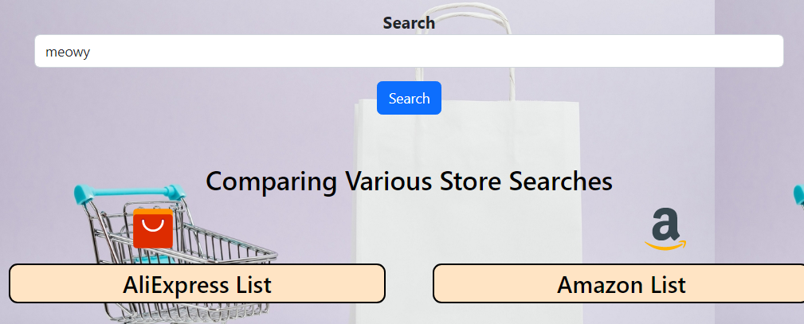
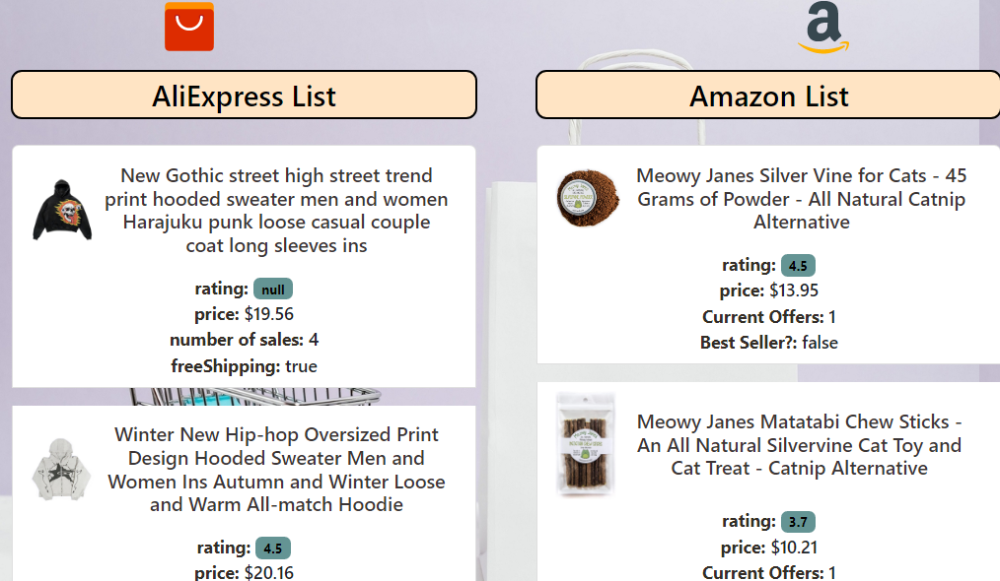
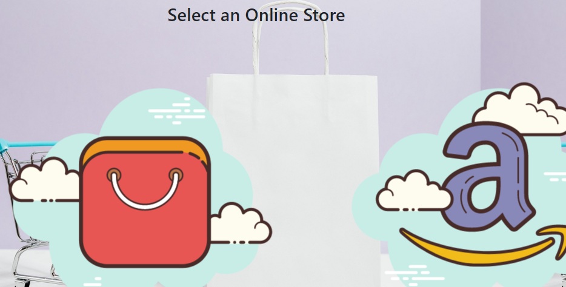
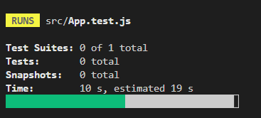
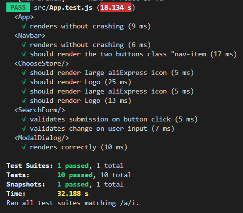

# Wallet Saver
 

## Description
Wallet saver is an application developed in react to provide product comparison for the user from two different sites. In this project we are using AliExpress and Amazon as our comparators. If a user search for a product in our landing page , then it will display the available products of the same in these two stores with price. It will help give the users a variety of options to choose from to optimize their shopping experience.

## **TOC**

- [Description](#Description)

- [Table Of Content](#TOC)

- [Our User Stories](#Stories)

- [Technologies Used](#Technologies)

- [Usage](#Usage)

- [Tests](#Tests)

- [Contributors](#Contributors)

## Stories

To better cater for your needs,  these were some of our starting points... sound familiar??

* As a buyer,I want to find the cheapest price on the market,so that I can purchase my desired item at a cheap rate.
* As a buyer,I want to buy a product at its lowest price without compromising the quality,so that I can buy at the best price.

## Technologies 

* React and ReactDOM
* Bootstrap
* Node.js
* Javascript
* Two API's : Amazon & Aliexpress
* Animation: GSAP
* Social Media Icons: fortawesome & fontawesome
* Netlify

## Usage

To start navigating functions, click on either the "Individual Stores" or "Compare Stores" options located on the navigation bar. 

The "Compare Stores" option will lead you directly to our winning comparison site where you can simply enter in your search prompt and get the results in separate columns.

Type in your desired item and click on search. 

Our search returns the bare minimum which each user needs to know, including the item image,  rating by other buyers, price, etc. 

To purchase an item, click on the title of the desired item; this will relocate you to the chosen item on the relevant site where more details are available.

Alternatively, you can browse items in each online store individually by clicking on the "Individual Stores". This will lead to the page below. Clicking on any of the floating icons will redirect you to the search bar where you can view only items available in the relevant store.

## Deployment 

The URL of the deployed application at Netlify:
is available [here](https://wallet-saver2.netlify.app/)

## Tests

For developers, the major components needed to render the app were tested prior to development. This was facilitated via use of enzyme and jest. Due to initial discrepancies between much needed dependencies, all tests are carried out in a react 16 version mirror, which is available on the **react-16-ver** branch.

To test, simply clone the repo, switch to the above stated branch and enter *npm test*. This will automatically run the tests written in *App.test.js*.

The final result should look something like this;

## Contributors

* Ambika (git [here](https://github.com/ambika-ks))
* Bolaji (git [here](https://github.com/bolajionaz))
* Georgia (git [here](https://github.com/GeorgiaM93))
* Israel (git [here](https://github.com/enwokedi96))
